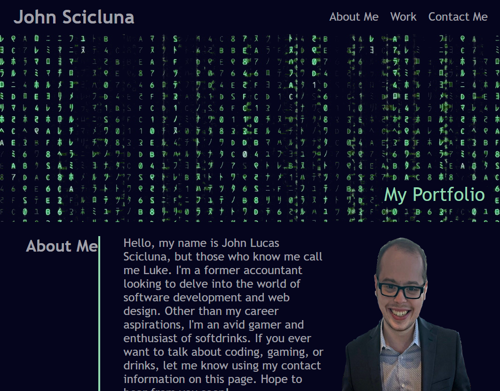

# Horiseon

The purpose of this project is to take all of the CSS and HTML knowledge that we have accumulated in the first month of bootcamp and put it to the test. This also gives us a great start in building our professional portfolio.

## Description

This webpage was a challenge to construct due to the stacking of elements and my desire to make everything look good at all viewport sizes. But ultimately, I think I did a pretty good job.
This portfolio webpage is entirely functional and gives anyone who shows up to it ways to contact me and learn a bit about me and my projects. There are also links directly to my deployed projects
for the visitor's convenience.

## Getting Started

No prior setup is required to view this project.

### Dependencies

There are no special dependencies to view this project.

### Installing

Just unzip and click on index.html or open it in your browser using this link: https://scicluna.github.io/My-Portfolio/

### Executing program

Simply run it in your browser to view the website in all of its glory!

## Help

For further help in using this website, or in learning about html/css, please email me at sciclunajl@gmail.com for discussion.

## Authors

John Sciclcuna
sciclunajl@gmail.com  
https://github.com/scicluna/My-Portfolio/  
https://scicluna.github.io/My-Portfolio/
